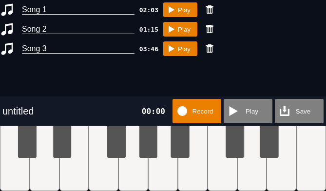

# Piano

A touch-enabled interactive piano, with recording feature. Written with basic Javascript/HTML5, with the [Web Audio API](https://developer.mozilla.org/en-US/docs/Web/API/Web_Audio_API) used for square-wave sound generation.

Try it out at [shone.dev/piano](https://shone.dev/piano/)

